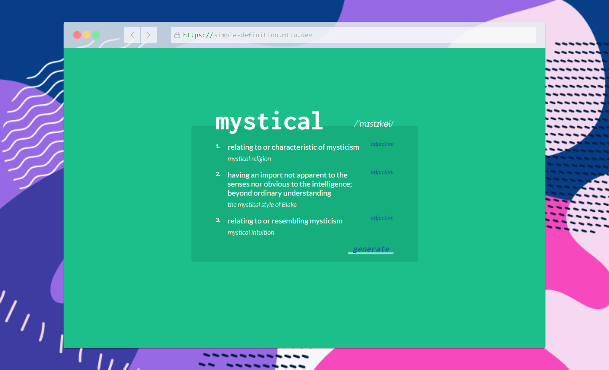

# 📖 Simple Definition

A simple web app that generates random words with definitions and examples. Made with React & CSS Modules - hosted on Netlify.

🔗 Link: [simple-definition.mttu.dev](https://simple-definition.mttu.dev/)\
🛠 Built with: `React, HTML/CSS`

